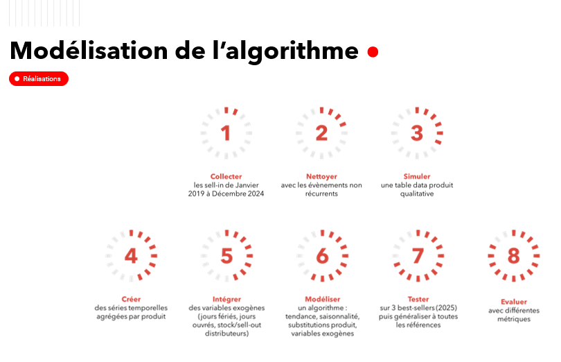
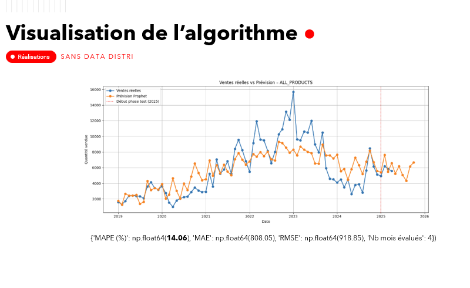
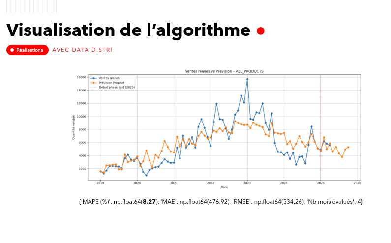

# Sales Forecasting for S&OP

## Context

This project is inspired by the implementation of a sales forecasting process in a complex B2B2B2C environment.

In this model:
- the manufacturer sells to distributors (sell-in)
- distributors sell to installers (sell-out)
- installers serve the final customer

This creates a major challenge for forecasting:

Relying only on sell-in data introduces strong biases:
- stock effects at distributor level distort real demand
- seasonality is poorly captured
- demand signals are delayed and incomplete

As a result:
- market changes are detected too late
- demand fluctuations propagate through the chain with amplification effects
- long industrial lead times increase the impact of forecast errors

👉 This makes it critical to build forecasts that better reflect real market dynamics.

---

## Objective

Develop a forecasting approach that produces more realistic and actionable predictions by integrating downstream demand signals into the model.

---

## Data

The dataset used in this project is synthetic and created for demonstration purposes.

It reproduces realistic business patterns inspired by real-world scenarios:
- product lifecycle (substitutions)
- seasonality
- demand variability across the distribution chain

No confidential or company data is used.

---

## Approach

The forecasting approach combines time series modeling with business-specific logic:

- aggregation of sales data at product level
- integration of product substitution logic (old → new references)
- inclusion of calendar effects (holidays, working days)
- integration of downstream demand signals (sell-out data from distributors)
- evaluation of model performance using multiple metrics

---

## Model

The model is based on Prophet, adapted to reflect business constraints.

It relies on an additive time series decomposition:

y(t) = trend + seasonality + holidays + regressors + error

Where:

- **Trend** captures long-term evolution  
- **Seasonality** models recurring patterns  
- **Holidays** capture calendar effects  
- **Regressors** integrate business drivers  

The objective is not only predictive accuracy, but also interpretability and business relevance.

---

## Key business contribution

The main improvement comes from integrating external business signals:

Instead of relying only on sell-in data, the model incorporates:
- sell-out data from distributors (proxy for real market demand)

👉 Impact:

- reduces bias caused by distributor stock variations  
- improves detection of real demand trends  
- captures seasonality closer to end-customer behavior  
- anticipates market changes earlier  

👉 In short:
the model becomes closer to actual market dynamics rather than internal shipment data.

---

## Forecasting workflow

The approach follows a structured pipeline from raw data to evaluation.

(visual below is in French, description provided here)

1. Data collection (historical sell-in data)
2. Data cleaning (removal of non-recurring events)
3. Data structuring (time series by product)
4. Feature engineering (holidays, working days, sell-out data)
5. Modeling (trend, seasonality, regressors)
6. Testing on selected products
7. Generalization to full product scope
8. Evaluation using multiple metrics

---

## Results

### Forecast based on sell-in only

### Forecast with external variables (sell-out data)

👉 The integration of downstream demand signals significantly improves model performance and stability.

It leads to:
- lower error metrics (MAPE, RMSE, MAE)
- better alignment with real demand patterns
- more stable and interpretable forecasts

---

## Evaluation

Model performance is evaluated using:

- MAPE  
- RMSE  
- MAE  

Comparison is performed:
- before vs after integration of external variables
- across multiple products

---

## Key takeaway

In a complex supply chain, forecasting based only on internal sales data is not sufficient.

Accurate forecasting requires:
- integrating downstream signals  
- understanding business structure  
- combining statistical models with domain knowledge  

👉 The value lies not only in the model, but in how it reflects real-world dynamics.

---

## Tech stack

Python · Pandas · Prophet · Time series modeling · Feature engineering · Data preprocessing · Visualization
